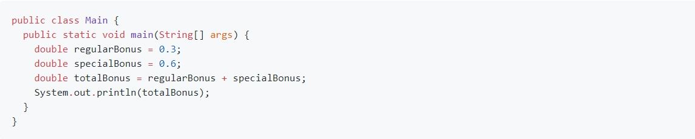

# Отчёт о тестировании приложения "Бонусная система"

## Краткое описание

12.09.2020 проведено позитивное функциональное тестирование приложения по добавлению дополнительных бонусов новым клиентам.

Входные данные:
написанный кусок кода программистами

На тестирование затрачено: - 0,5 часа.

## Описание тестов

Проведено позитивное функциоанальное тестирование приложения по добавлению дополнительных бонусов новым клиентам.
Теcтировалась функция суммирования дробных (нецелых) чисел.

## Результаты

1. Некорректное отображение результата суммирования двух дробных чисел (0.3 и 0.6). Результат: 0.8999999999999999
2. [https://github.com/AnastasiyaSergeichik/Precision/issues/1](https://github.com/AnastasiyaSergeichik/Precision/issues/1)

## Общие рекомендации

Данная проблема возникает только при суммировании дробных чисел 0.3 и 0.6

**Тестирование производилось в следующем окружении:**
 notebook LG-book;
 Windows 10;
 Java, Version 11.0.8;
 Chrome, Version 84.0.4147.105